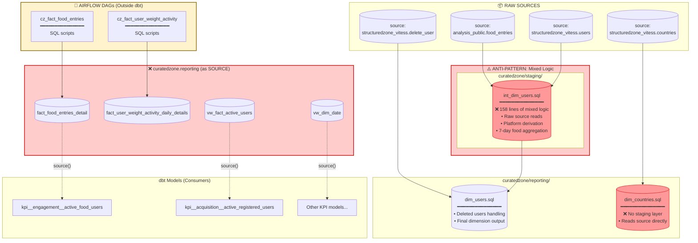

# Current State Diagram (Anti-Pattern)

This diagram shows the current problematic architecture where staging and intermediate logic are mixed together.

## Problems Highlighted

| Issue | Description |
|-------|-------------|
| 🔴 **Mixed Logic** | `int_dim_users.sql` combines staging + intermediate logic in 158 lines |
| 🔴 **No Staging** | `dim_countries.sql` reads directly from source without staging abstraction |
| 🔴 **Circular Dependency** | dbt writes to `curatedzone.reporting` AND reads from it as source |
| 🔴 **Broken Lineage** | Airflow DAGs create tables that dbt consumes, breaking the lineage graph |
| 🔴 **No Tests** | Source tables have no freshness checks or automated tests |

