# Current State Diagram (Anti-Pattern)

This diagram shows the current problematic architecture where staging and intermediate logic are mixed together.

```mermaid
flowchart TB
    subgraph SOURCES["📦 RAW SOURCES"]
        S1[("source:<br/>analysis_public.food_entries")]
        S2[("source:<br/>structuredzone_vitess.users")]
        S3[("source:<br/>structuredzone_vitess.delete_user")]
        S4[("source:<br/>structuredzone_vitess.countries")]
    end

    subgraph PROBLEM["⚠️ ANTI-PATTERN: Mixed Logic"]
        subgraph CURATED_STAGING["curatedzone/staging/"]
            INT_DIM[("int_dim_users.sql<br/>━━━━━━━━━━━━━━━<br/>❌ 158 lines of mixed logic<br/>• Raw source reads<br/>• Platform derivation<br/>• 7-day food aggregation")]
        end
    end

    subgraph CURATED_REPORTING["curatedzone/reporting/"]
        DIM_USERS[("dim_users.sql<br/>━━━━━━━━━━━━━━━<br/>• Deleted users handling<br/>• Final dimension output")]
        DIM_COUNTRIES[("dim_countries.sql<br/>━━━━━━━━━━━━━━━<br/>❌ No staging layer<br/>• Reads source directly")]
    end

    subgraph AIRFLOW["🔧 AIRFLOW DAGs (Outside dbt)"]
        DAG1["cz_fact_food_entries<br/>━━━━━━━━━━━━━━━<br/>SQL scripts"]
        DAG2["cz_fact_user_weight_activity<br/>━━━━━━━━━━━━━━━<br/>SQL scripts"]
    end

    subgraph CURATEDZONE_TABLES["❌ curatedzone.reporting (as SOURCE)"]
        FACT1[("fact_food_entries_detail")]
        FACT2[("fact_user_weight_activity_daily_details")]
        VW1[("vw_fact_active_users")]
        VW2[("vw_dim_date")]
    end

    subgraph DBT_CONSUMERS["dbt Models (Consumers)"]
        KPI1["kpi__engagement__active_food_users"]
        KPI2["kpi__acquisition__active_registered_users"]
        KPI3["Other KPI models..."]
    end

    S1 --> INT_DIM
    S2 --> INT_DIM
    S3 --> DIM_USERS
    S4 --> DIM_COUNTRIES

    INT_DIM --> DIM_USERS

    DAG1 --> FACT1
    DAG2 --> FACT2

    FACT1 -.->|"source()"| KPI1
    VW1 -.->|"source()"| KPI2
    VW2 -.->|"source()"| KPI3

    style PROBLEM fill:#ffcccc,stroke:#cc0000,stroke-width:2px
    style AIRFLOW fill:#fff3cd,stroke:#856404,stroke-width:2px
    style CURATEDZONE_TABLES fill:#ffcccc,stroke:#cc0000,stroke-width:2px
    style INT_DIM fill:#ff9999,stroke:#cc0000
    style DIM_COUNTRIES fill:#ff9999,stroke:#cc0000
```

## Problems Highlighted

| Issue | Description |
|-------|-------------|
| 🔴 **Mixed Logic** | `int_dim_users.sql` combines staging + intermediate logic in 158 lines |
| 🔴 **No Staging** | `dim_countries.sql` reads directly from source without staging abstraction |
| 🔴 **Circular Dependency** | dbt writes to `curatedzone.reporting` AND reads from it as source |
| 🔴 **Broken Lineage** | Airflow DAGs create tables that dbt consumes, breaking the lineage graph |
| 🔴 **No Tests** | Source tables have no freshness checks or automated tests |

