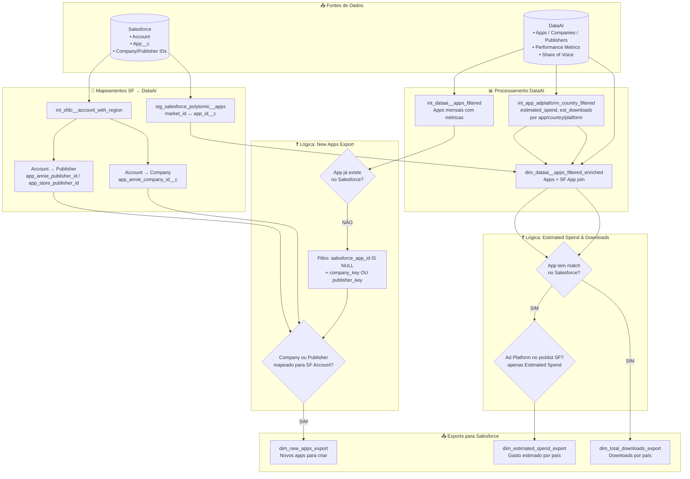
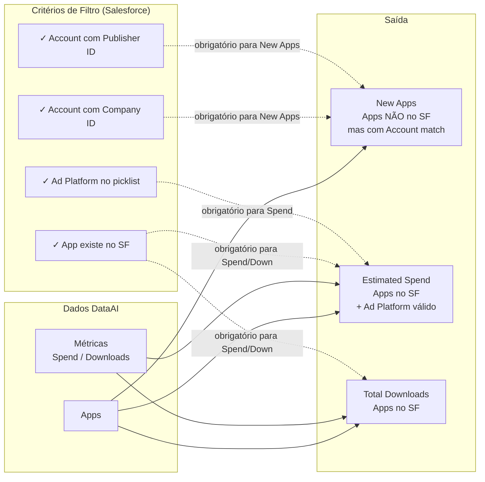

# Fluxo de Dados - Market Data Exports (DataAI → Salesforce)

Diagrama simplificado do pipeline de Market Data que alimenta o Salesforce com relatórios baseados em dados do DataAI, utilizando dados existentes do Salesforce para limitar as saídas.

## Diagrama Principal



## Diagrama Simplificado (Visão de Decisão)

Versão focada apenas na lógica de decisão e critérios de filtro:



## Resumo da Lógica por Export

| Export | Condição Principal | Objetivo |
|--------|-------------------|----------|
| **dim_new_apps_export** | `salesforce_app_id IS NULL` + Company ou Publisher mapeado para SF Account | Descobrir apps novos que pertencem a contas existentes no Salesforce |
| **dim_estimated_spend_export** | `app_id IS NOT NULL` + Ad Platform no picklist SF + `estimated_spend > 0` | Relatório de gasto estimado por app/country para apps já no Salesforce |
| **dim_total_downloads_export** | `app_id IS NOT NULL` | Relatório de downloads por app/country para apps já no Salesforce |

## Dependências Principais

```
DataAI (stg_dataai__*, int_dataai__*)
    ↓
dim_dataai__apps_filtered_enriched ←── join com stg_salesforce_polytomic__apps
    ↓
int_app_adplatform_country_filtered (reporting_month)
    ↓
┌─────────────────────────────────────────────────────────────┐
│  int_dataai__apps_filtered (salesforce_app_id IS NULL)      │
│       + int_sfdc__account_to_dataai_company_relationships   │
│       + int_sfdc__account_to_dataai_publisher_relationships │
│       → dim_new_apps_export                                  │
└─────────────────────────────────────────────────────────────┘

┌─────────────────────────────────────────────────────────────┐
│  int_app_adplatform_country_filtered                        │
│       + dim_dataai__apps_filtered_enriched (app_id match)    │
│       + int_ios_android_adplatform_stats (picklist)         │
│       → dim_estimated_spend_export / dim_total_downloads_export │
└─────────────────────────────────────────────────────────────┘
```
