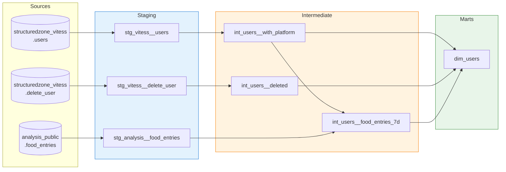
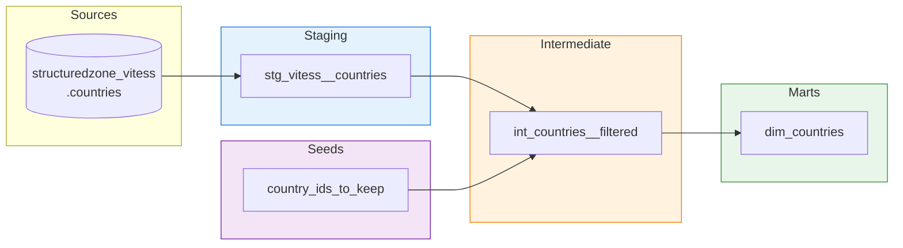
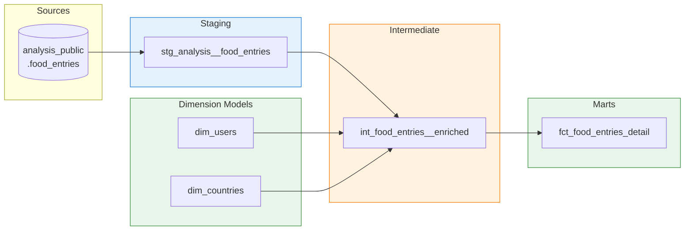
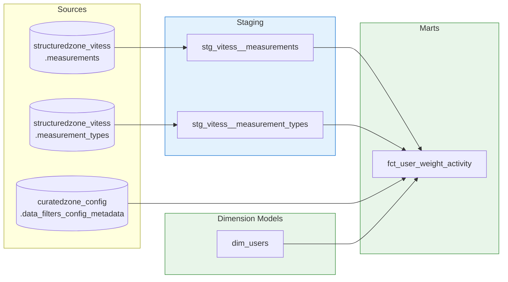

# Model Dependencies Diagram

This diagram shows the detailed dependencies between all models in the target architecture.

## dim_users Lineage

## dim_countries Lineage

## fct_food_entries_detail Lineage

## fct_user_weight_activity Lineage

## Complete Model DAG

```mermaid
flowchart TB
    subgraph SOURCES["📦 Sources"]
        SRC_USERS[("users")]
        SRC_DELETE[("delete_user")]
        SRC_COUNTRIES[("countries")]
        SRC_MEASUREMENTS[("measurements")]
        SRC_MEAS_TYPES[("measurement_types")]
        SRC_FOOD[("food_entries")]
        SRC_CONFIG[("data_filters")]
    end

    subgraph STAGING["🔷 Staging Layer"]
        stg_users["stg_vitess__users"]
        stg_delete["stg_vitess__delete_user"]
        stg_countries["stg_vitess__countries"]
        stg_meas["stg_vitess__measurements"]
        stg_meas_types["stg_vitess__measurement_types"]
        stg_food["stg_analysis__food_entries"]
    end

    subgraph SEEDS["🌱 Seeds"]
        seed_countries["country_ids_to_keep"]
    end

    subgraph INTERMEDIATE["🔶 Intermediate Layer"]
        int_platform["int_users__with_platform"]
        int_deleted["int_users__deleted"]
        int_food_7d["int_users__food_entries_7d"]
        int_countries["int_countries__filtered"]
        int_food_enriched["int_food_entries__enriched"]
    end

    subgraph MARTS["🟢 Marts Layer"]
        dim_users["dim_users"]
        dim_countries["dim_countries"]
        dim_date["dim_date"]
        fct_food["fct_food_entries_detail"]
        fct_weight["fct_user_weight_activity"]
    end

    %% Source connections
    SRC_USERS --> stg_users
    SRC_DELETE --> stg_delete
    SRC_COUNTRIES --> stg_countries
    SRC_MEASUREMENTS --> stg_meas
    SRC_MEAS_TYPES --> stg_meas_types
    SRC_FOOD --> stg_food

    %% Staging to Intermediate
    stg_users --> int_platform
    stg_delete --> int_deleted
    stg_countries --> int_countries
    stg_food --> int_food_7d
    stg_food --> int_food_enriched
    seed_countries --> int_countries
    int_platform --> int_food_7d

    %% Intermediate to Marts
    int_platform --> dim_users
    int_deleted --> dim_users
    int_food_7d --> dim_users
    int_countries --> dim_countries

    %% Marts internal
    dim_users --> int_food_enriched
    dim_countries --> int_food_enriched
    int_food_enriched --> fct_food

    %% Fact dependencies
    stg_meas --> fct_weight
    stg_meas_types --> fct_weight
    SRC_CONFIG --> fct_weight
    dim_users --> fct_weight

    style STAGING fill:#e3f2fd,stroke:#1976d2,stroke-width:2px
    style INTERMEDIATE fill:#fff3e0,stroke:#f57c00,stroke-width:2px
    style MARTS fill:#e8f5e9,stroke:#388e3c,stroke-width:2px
    style SEEDS fill:#f3e5f5,stroke:#7b1fa2,stroke-width:2px
```

