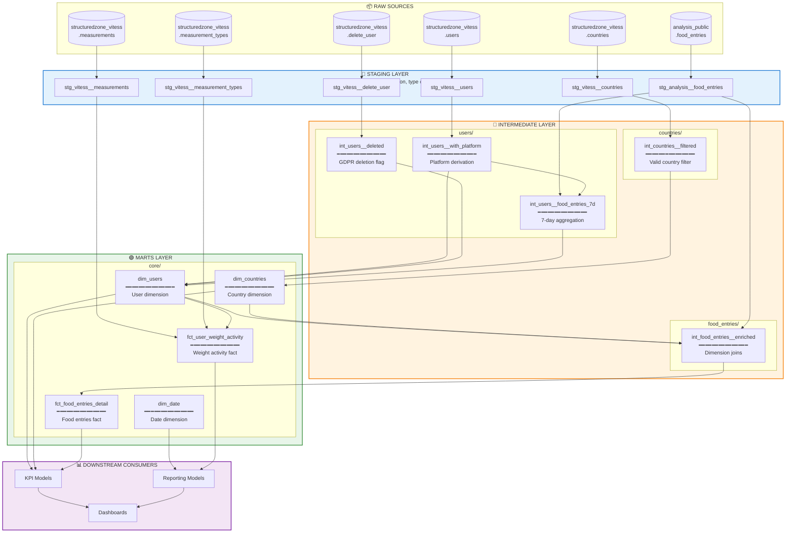

# Target State Diagram (Best Practice)

This diagram shows the target architecture following dbt best practices with clear separation: **Staging → Intermediate → Marts**.

## Benefits of Target Architecture

| Benefit | Description |
|---------|-------------|
| ✅ **Clear Separation** | Each layer has a single responsibility |
| ✅ **Reusable Staging** | Staging models can be reused across multiple intermediates |
| ✅ **Testable** | Each layer can have its own tests |
| ✅ **Full Lineage** | Complete data flow visibility in dbt docs |
| ✅ **Maintainable** | Small, focused files (10-50 lines each) |
| ✅ **No Circular Dependencies** | All sources are external, all outputs are models |

