# Target State Diagram (Best Practice)

This diagram shows the target architecture following dbt best practices with clear separation: **Staging → Intermediate → Marts**.

```mermaid
flowchart TB
    subgraph SOURCES["📦 RAW SOURCES"]
        direction LR
        S1[("structuredzone_vitess<br/>.users")]
        S2[("structuredzone_vitess<br/>.delete_user")]
        S3[("structuredzone_vitess<br/>.countries")]
        S4[("structuredzone_vitess<br/>.measurements")]
        S5[("structuredzone_vitess<br/>.measurement_types")]
        S6[("analysis_public<br/>.food_entries")]
    end

    subgraph STAGING["🔷 STAGING LAYER<br/>Source abstraction, type casting, renaming"]
        direction LR
        STG1["stg_vitess__users"]
        STG2["stg_vitess__delete_user"]
        STG3["stg_vitess__countries"]
        STG4["stg_vitess__measurements"]
        STG5["stg_vitess__measurement_types"]
        STG6["stg_analysis__food_entries"]
    end

    subgraph INTERMEDIATE["🔶 INTERMEDIATE LAYER<br/>Business logic, aggregations, transformations"]
        subgraph INT_USERS["users/"]
            INT1["int_users__with_platform<br/>━━━━━━━━━━━━━━━<br/>Platform derivation"]
            INT2["int_users__deleted<br/>━━━━━━━━━━━━━━━<br/>GDPR deletion flag"]
            INT3["int_users__food_entries_7d<br/>━━━━━━━━━━━━━━━<br/>7-day aggregation"]
        end
        subgraph INT_COUNTRIES["countries/"]
            INT4["int_countries__filtered<br/>━━━━━━━━━━━━━━━<br/>Valid country filter"]
        end
        subgraph INT_FOOD["food_entries/"]
            INT5["int_food_entries__enriched<br/>━━━━━━━━━━━━━━━<br/>Dimension joins"]
        end
    end

    subgraph MARTS["🟢 MARTS LAYER<br/>Final business entities"]
        subgraph CORE["core/"]
            DIM_USERS["dim_users<br/>━━━━━━━━━━━━━━━<br/>User dimension"]
            DIM_COUNTRIES["dim_countries<br/>━━━━━━━━━━━━━━━<br/>Country dimension"]
            DIM_DATE["dim_date<br/>━━━━━━━━━━━━━━━<br/>Date dimension"]
            FCT_FOOD["fct_food_entries_detail<br/>━━━━━━━━━━━━━━━<br/>Food entries fact"]
            FCT_WEIGHT["fct_user_weight_activity<br/>━━━━━━━━━━━━━━━<br/>Weight activity fact"]
        end
    end

    subgraph CONSUMERS["📊 DOWNSTREAM CONSUMERS"]
        KPI1["KPI Models"]
        KPI2["Reporting Models"]
        KPI3["Dashboards"]
    end

    %% Source to Staging
    S1 --> STG1
    S2 --> STG2
    S3 --> STG3
    S4 --> STG4
    S5 --> STG5
    S6 --> STG6

    %% Staging to Intermediate
    STG1 --> INT1
    STG2 --> INT2
    STG6 --> INT3
    STG3 --> INT4
    STG4 --> FCT_WEIGHT
    STG5 --> FCT_WEIGHT
    STG6 --> INT5

    %% Intermediate to Intermediate
    INT1 --> INT3

    %% Intermediate to Marts
    INT1 --> DIM_USERS
    INT2 --> DIM_USERS
    INT3 --> DIM_USERS
    INT4 --> DIM_COUNTRIES

    %% Marts internal dependencies
    DIM_USERS --> INT5
    DIM_COUNTRIES --> INT5
    INT5 --> FCT_FOOD
    DIM_USERS --> FCT_WEIGHT

    %% Marts to Consumers
    DIM_USERS --> KPI1
    DIM_COUNTRIES --> KPI1
    DIM_DATE --> KPI2
    FCT_FOOD --> KPI1
    FCT_WEIGHT --> KPI2
    KPI1 --> KPI3
    KPI2 --> KPI3

    style STAGING fill:#e3f2fd,stroke:#1976d2,stroke-width:2px
    style INTERMEDIATE fill:#fff3e0,stroke:#f57c00,stroke-width:2px
    style MARTS fill:#e8f5e9,stroke:#388e3c,stroke-width:2px
    style CONSUMERS fill:#f3e5f5,stroke:#7b1fa2,stroke-width:2px
```

## Benefits of Target Architecture

| Benefit | Description |
|---------|-------------|
| ✅ **Clear Separation** | Each layer has a single responsibility |
| ✅ **Reusable Staging** | Staging models can be reused across multiple intermediates |
| ✅ **Testable** | Each layer can have its own tests |
| ✅ **Full Lineage** | Complete data flow visibility in dbt docs |
| ✅ **Maintainable** | Small, focused files (10-50 lines each) |
| ✅ **No Circular Dependencies** | All sources are external, all outputs are models |

